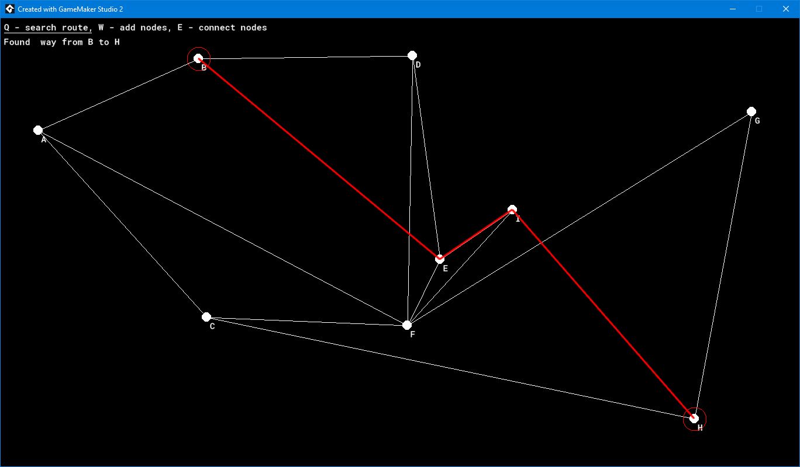

# Dijsktra pathfinding in weighted graph for GameMaker

This is example of pathfinding in weighted graph, using Dijsktra alghoritm.
It uses priority queques for searching rather than matrices, which would require NxN array, where N is number of nodes.

Also contains an example of creating/updating/displaying graph, which isn't required to work.

# Znajdywanie drogi w grafie z wagami używając alorytmu Dijsktry dla GameMaker

Przykład znajdywania drogi w grafie z wagami używając alorytmu Dijsktry.
Korzysta z kolejek priorytetowych zamiast z macierzy, co wymagałoby tablicy o rozmiarze NxN, gdzie N to licza wierzchołków.

Zawiera te przykład dodawania/edytowania/wyświetlania grafu, który nie jest wymagany do działania.

---

*GameMaker was previously known as GameMaker Studio 2.